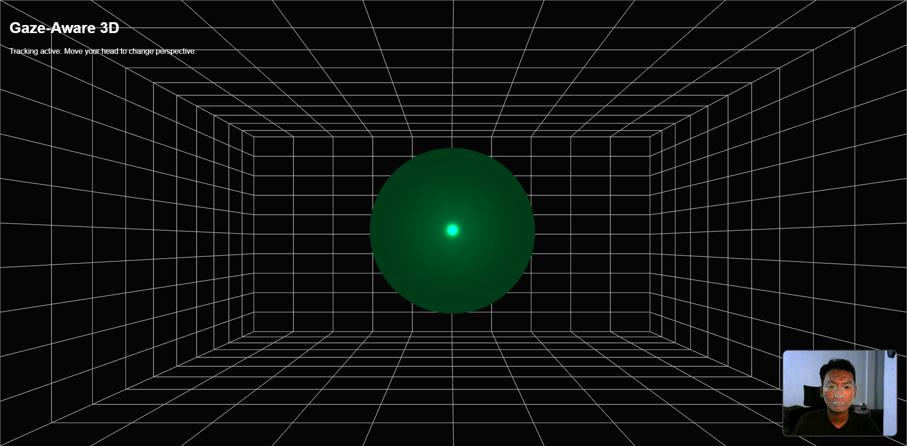

# Gaze-Aware 3D Display Web App

An interactive web application that creates a **3D Window (Pseudo-Holographic) Effect** using your device's camera to track your head position in real-time. The monitor acts as a literal "window" into a 3D box, with the perspective shifting dynamically as you move.



## 🚀 Key Features

- **Off-Axis Perspective**: Implemented using *Asymmetric View Frustum* techniques to keep the screen edges "locked" as the front face of the 3D room.
- **Real-time Face Tracking**: Powered by [MediaPipe Face Mesh](https://google.github.io/mediapipe/solutions/face_mesh) for high-precision, low-latency landmark detection.
- **3D Grid Room**: A depth-optimized background designed to maximize the 3D parallax effect.
- **Visual Feedback**: Real-time webcam preview with a face mesh overlay to help users stay within tracking range.
- **Refined Movement**: Sophisticated smoothing (lerp) and clamping logic to ensure perspective shifts are natural and stable.

## 🛠️ Tech Stack

- **Core**: JavaScript (ESM)
- **3D Engine**: [Three.js](https://threejs.org/)
- **Computer Vision**: [MediaPipe Face Mesh](https://cdn.jsdelivr.net/npm/@mediapipe/face_mesh)
- **Bundler**: [Vite](https://vitejs.dev/)

## 📦 Installation & Setup

Follow these steps to run the project locally:

1. **Clone the repository**:
   ```bash
   git clone <your-repo-url>
   cd gaze-aware-3d
   ```

2. **Install dependencies**:
   ```bash
   npm install
   ```

3. **Run the development server**:
   ```bash
   npm run dev
   ```

4. **Launch the App**:
   Open the URL provided by Vite (usually `http://localhost:5173`) and grant camera permissions.

## 💡 How to Use

- Position yourself clearly in front of your webcam.
- Wait for the status to show **"Tracking active"**.
- Move your head left, right, up, or down.
- Notice how the interior of the 3D box reveals different angles based on your position, while the edges of the box stay perfectly aligned with your monitor's frame.

## 📂 Project Structure

```text
gaze-aware-3d/
├── src/
│   ├── three/
│   │   ├── scene.js            # Scene initialization, grid room, & lighting
│   │   └── cameraController.js  # Off-Axis perspective & smoothing logic
│   ├── tracking/
│   │   └── faceTracker.js       # MediaPipe integration & position extraction
│   └── main.js                  # Application entry point
├── index.html                   # Main UI structure
└── package.json                 # Project configuration & dependencies
```